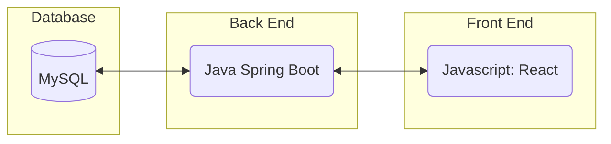
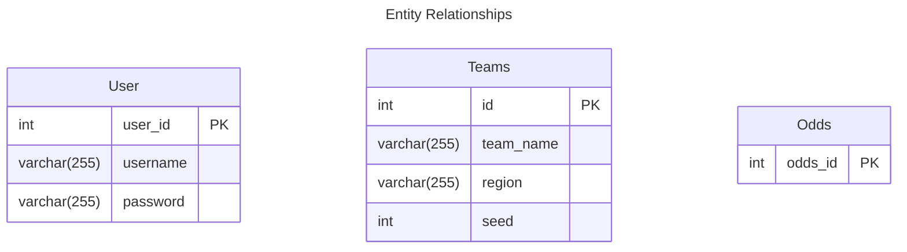
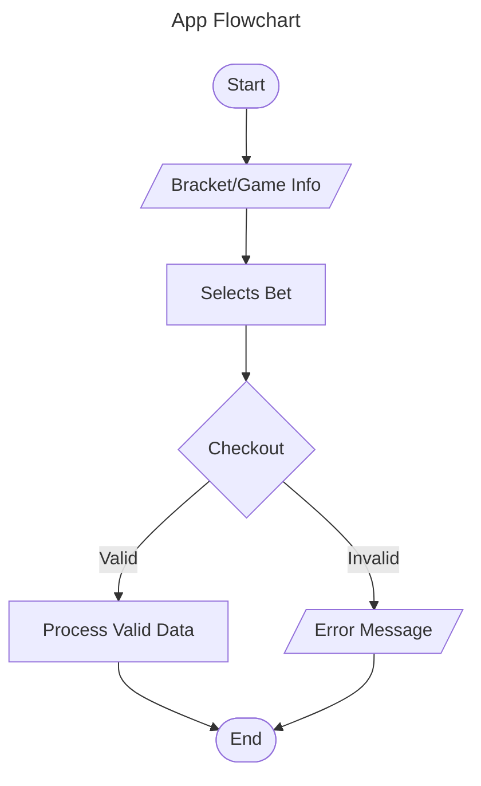

# March Madness Bets Web App

Web application for users to place bets and check bet status using fake money.

NOTE: Website is not fully functional due to augmenting code for virtual machine hosting, which has been lost due to school requirements.

## Overview
- Creates a website for users to bet for free/practice betting for March Madness basketball
- For users who want to bet on college basketball games without the need to spend money
- Full-stack application hosted on a virtual machine via docker containers

## My Role

**Type:** Team project (6 members)

### My Contributions
- Created backend endpoints to communicate to frontend and MySQL database
- Containerized the application to be hosted locally via docker containers
- Transitioned the application to be hosted on a virtual machine via docker containers

## Tech Stack
- Frontend: JavaScript, CSS
- Backend: Java, Spring Boot, Maven
- Database: MySQL relational database
- Other Tools: Docker

## Key Features
- User account login/signup
- March Madness Bracket with custom algorithm for odds
- Bet feature that updates bets ~1 minute after bet is placed
- Website scraper to populate team bracket

## Challenges & Learnings
- Issues with communication between backend and database communication after containerizing the application
- Learned patience and troubleshooting strategies, communication, and agile/scrum principles

## Running the Project

```bash
git clone https://github.com/TGrim-03/March-Madness-Bets.git
```
Run the compose.yml file either via IDE or the following command:

```bash
docker compose up
```

## Original README file:

<p align="center" style="font-size: 30px;">
  <b>Net Bets Specification Document<b>
</p>

<!--# Net Bets Specification Document-->

This is a living document and will need to be updated regularly.

<!--Please fill out this document to reflect your team's project. This is a living document and will need to be updated regularly. You may also remove any section to its own document (e.g. a separate standards and conventions document), however you must keep the header and provide a link to that other document under the header.
* Also, be sure to check out the Wiki for information on how to maintain your team's requirements.-->

## Net Bets

<!--The name of your team.-->


### Project Abstract

<!--* This is an example paragraph written in markdown. You can use *italics*, **bold**, and other formatting options. You can also <u>use inline html</u> to format your text. 
The example sections included in this document are not necessarily all the sections you will want, and it is possible that you won't use all the one's provided. -->
<!--It is your responsibility to create a document that adequately conveys all the information about your project specifications and requirements.-->


* This is Net Bets – a fun, interactive web application where users can bet on this year’s March Madness games using fake money. This project is designed to give fans an engaging experience. 

* Features include placing bets on bracket predictions, leaderboards, a stats dashboard, and periodic updates. 

### Customer

<!--A brief description of the customer for this software, both in general (the population who might eventually use such a system) and specifically for this document (the customer(s) who informed this document). Every project will have a customer from the CS506 instructional staff. Requirements should not be derived simply from discussion among team members. Ideally your customer should not only talk to you about requirements but also be excited later in the semester to use the system.-->

An archetypal customer is a student that is an avid fan of college basketball and would like to engage in March Madness predictions with peers on an easy-to-use platform. 

This customer will also have baseline knowledge of sports betting and the March Madness Bracket. 

### Specification

<!--A detailed specification of the system. UML, or other diagrams, such as finite automata, or other appropriate specification formalisms, are encouraged over natural language.-->

<!--Include sections, for example, illustrating the database architecture (with, for example, an ERD).-->

<!--Included below are some sample diagrams, including some example tech stack diagrams.-->

#### Technology Stack





Frontend: 
* React.js

Backend: 
* Java Spring Boot

Data: 
* Relational MySQL Database
* JavaScript for data scraping for up-to-date data


#### Database



#### Flowchart



### How To Run (TODO update)

#### Requirements
* Java v23
  * Relevant JDK
* node v23
* npm 10.9

#### Start frontend and backend 
* Backend
  * Use IDE or `./mvnw spring-boot:run`

* Frontend
  * `npm start`
  * may have to install additional packages such as lucide-react and create-react-app ex: `npm install lucide-react`


### Contributors
Sohalliya Jain
Aditya Mehrotra
Arushi Taneja
Revanth Madineni
Tyler Grim
Kevin Yuan

### Standards & Conventions

<!--This is a link to a seperate coding conventions document / style guide-->
[Style Guide & Conventions](STYLE.md)

